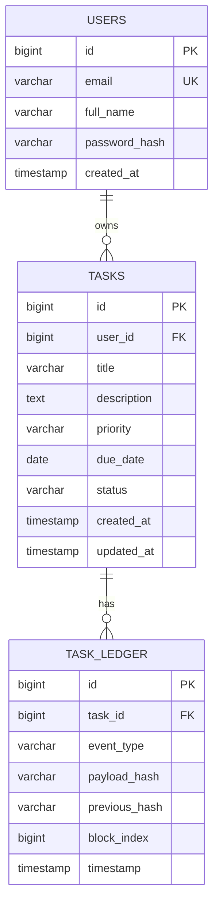

# Database Schema

## ER Diagram

## Tables

### users

| Column | Type | Notes |
|--------|------|-------|
| id | BIGINT | PK, auto-increment |
| email | VARCHAR(100) | UNIQUE, NOT NULL |
| full_name | VARCHAR(100) | NOT NULL |
| password_hash | VARCHAR | NOT NULL (BCrypt) |
| created_at | TIMESTAMP | NOT NULL |

### tasks

| Column | Type | Notes |
|--------|------|-------|
| id | BIGINT | PK |
| user_id | BIGINT | FK → users.id |
| title | VARCHAR(200) | NOT NULL |
| description | TEXT | |
| priority | ENUM | LOW, MEDIUM, HIGH |
| due_date | DATE | |
| status | ENUM | TODO, IN_PROGRESS, DONE |
| created_at | TIMESTAMP | NOT NULL |
| updated_at | TIMESTAMP | |

### task_ledger (blockchain bonus)

| Column | Type | Notes |
|--------|------|-------|
| id | BIGINT | PK |
| task_id | BIGINT | FK → tasks.id |
| event_type | VARCHAR(50) | e.g. TASK_CREATED, STATUS_CHANGED |
| payload_hash | VARCHAR(64) | SHA-256 hex |
| previous_hash | VARCHAR(64) | Previous block hash (genesis = 64 zeros) |
| block_index | BIGINT | Sequential per task |
| timestamp | TIMESTAMP | NOT NULL |
